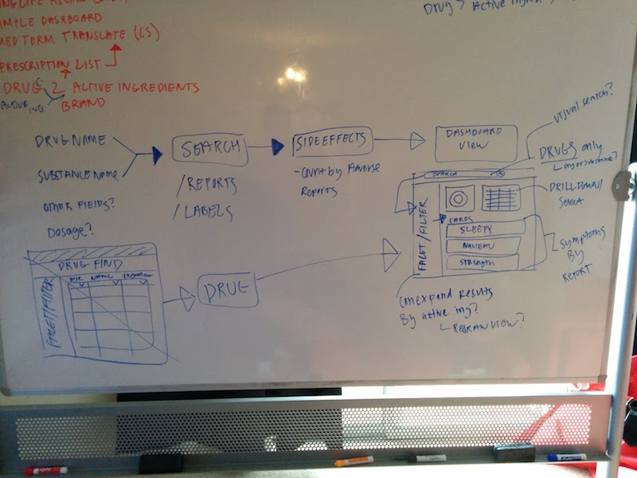
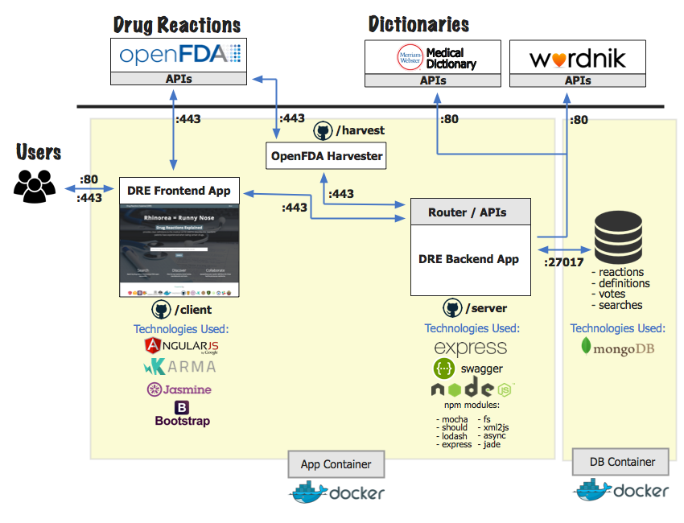
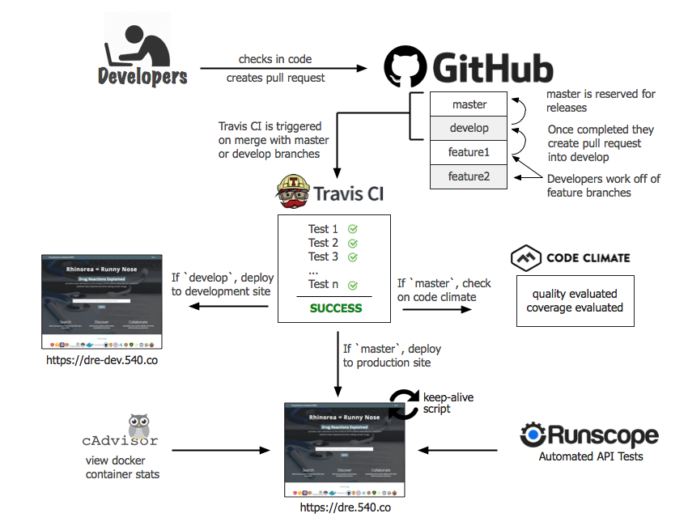

#Drug Reactions Explained
[](https://travis-ci.org/540co/ads-bpa)
[](https://codeclimate.com/github/540co/ads-bpa)
[](https://codeclimate.com/github/540co/ads-bpa/coverage)
[](https://slackin.540.co)


Key Links  | URLs 
 ------------- | ------------- 
 Production App    | [dre.540.co](https://dre.540.co)   
 Production API Docs    | [dre.540.co/apidocs](https://dre.540.co/apidocs) 
 Development Environment    | [dre-dev.540.co](https://dre-dev.540.co) 
 API Documentation    | [dre.540.co/apidocs](https://dre.540.co/apidocs) 
 cAdvisor Monitoring    | [dre-monitor.540.co](https://dre-monitor.540.co) 
 Architectural Docs    | [./server/docs](https://github.com/540co/ads-bpa/blob/master/server/docs)

```
This prototype was built for Chrome and Firefox (IE Compatibility not currently tested)
```


The **M-Cubed/540 Team** used an Agile, Test-Driven development process to build our OpenFDA prototype for the Agile Delivery Services BPA response.  

Upon receiving the RFQ, our team performed an OpenFDA spike to better understand the datasets available, including boundary analysis and technical/functional restriction identification.  A brainstorming session ensued, coordinated by our product owner and attended by all team members, to select an idea for prototyping.  

Many ideas were presented to the product owner, and the decision was made to build a dashboard allowing users to find common drug reactions and other useful reaction-based metrics for a given brand name (i.e. Enbrel) or active ingredient (i.e. acetaminophen).  Additionally, the dashboard would create a convenient method to translate medical terminology into layman's terms.

**Once “Drug Reactions Explained” (DRE) was conceptualized, the product backlog was filled with user stories coming from the storyboarding meetings.** 
 


Acting as ScrumMaster, the Technical Architect migrated the stories into the team’s GitHub issue tracker identifying which tasks would be part of the Minimum Viable Product (MVP).  

Based on the short duration of the challenge, the ScrumMaster decided to have two 3-4 day sprints.

The first sprint was dedicated to tasks required to deliver the MVP, and the subsequent sprint allowed for feedback from the product owner to enhance, pivot, and refine the MVP.  

Major features coming from the second sprint included the ability for users to:

* add custom definitions for medical terms

* vote up/down definitions (crowdsourcing)

* save searches and retrieve most active search terms  



The team met for sprint planning meetings (to estimate time and capacity needed to deliver the functionality) and sprint review meetings (to demonstrate capabilities to the product owner, receive feedback, and better understand team velocity).  A retrospective meeting occurred after the second sprint to learn how the team could be more efficient and improve the process.

To demonstrate the team's ability to respond to change, a third sprint was completed after proposal deadlines were delayed to improve automated testing, improve documentation/commenting, and fix bugs.

**It was important for our team to maintain clear lines of responsibility during the prototyping effort because we believe in the importance of teamwork and collaboration.**

We organized our team around the labor categories listed with the BPA, which included:

* Technical Architect (leader of our Dev Challenge effort)

* Product Owner (making left or right decisions on product functionality)

* Front End Developers (focusing their time on creating the UI/UX including API integrations)

* Back End Developers (building the DRE APIs)

* DevOps Engineer (ensuring continuous integration, deployment and monitoring strategies were executed and maintained)  

**Considering the heavy focus of DevOps tasks described in the RFQ**, our team’s dedicated DevOps Engineer produced a production-ready environment and process to build, deploy, and maintain DRE.  

From a continuous integration perspective, we configured TravisCI to run on all merges with the develop branch (triggered by pull requests from feature branches) and our master branch that housed our releases and all merges from the develop branch.  This solution was integrated closely with GitHub to monitor each pull request and approve/reject merges based on the results.  


TravisCI also integrated monitoring of our code climate and unit test code coverage (as displayed in GitHub).  TravisCI also controlled the continuous deployment (on merge) from the `develop` branch to our development environment and from the `master` branch to our production environment.  

Other monitoring tools such as New Relic (application-level and server-level monitoring), cAdvisor (Docker container monitoring), Slack (monitoring messages were pushed to our team’s chat channel) and Runscope (automated testing of our APIs) were also configured.



**During this prototyping effort, a core team tenet was transparency internally and externally.**

To embrace transparency we:

* completed the entire challenge in a public GitHub repository

* opened our team’s internal #18FAgileBPA slack channel for outside contributions

* created the #18FAgileBPA hashtag and encouraged all bidders to join our conversation on Twitter

* live-streamed video of our work on Meerkat and Periscope (published to YouTube)


By staying transparent and utilizing open-source technologies, our team showed the ability to build a quality prototype quickly and collaboratively using SCRUM Agile (having a little fun in the process!). 
